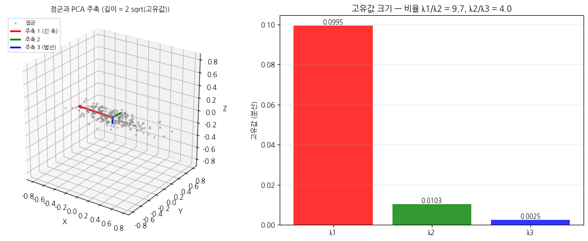
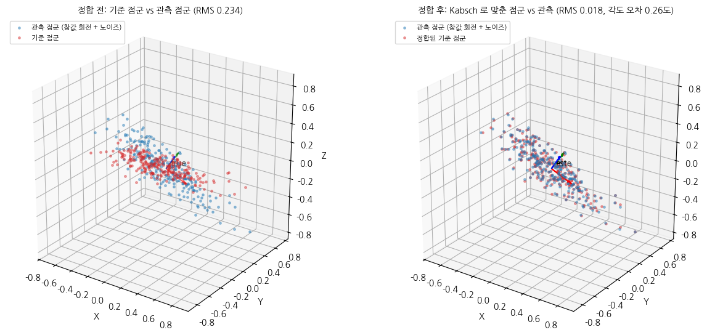
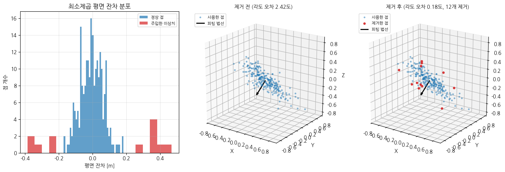
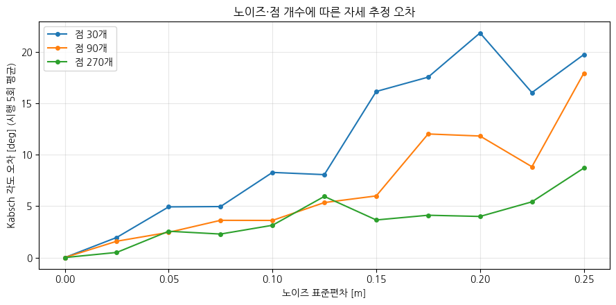

# 모듈 ④ 발표 자료 — 픽앤플레이스 자세 추정과 궤적 생성

이름: 박준명 / 작성일: 2026-09-09

## 1. 파이프라인 전체 구조


좌표계는 base → link → camera → object로 연결된다. T_base_object = T_base_camera @ T_camera_object로 합성한다.
01 노트북은 좌표 변환과 관절 회전, 02는 쿼터니언·위치 보간, 03은 점군 추정과 시연을 담당한다.
03에서는 카메라 좌표에서 물체 자세를 PCA로 추정한 뒤 base로 옮긴다. Kabsch는 별도의 대응 점군 정합 실험에서 정확도를 평가한다.
모듈 ③의 회전·동차변환·좌표 체인 함수를 재사용하고, PosePipeline, 쿼터니언 보간, 궤적 보간, PCA·Kabsch·평면 피팅 함수를 구현했다.

## 2. 자세 추정 결과와 오차

PCA 주축은 다음 행렬의 열이다.

```text
[[-0.999269  0.037052 -0.009388]
 [ 0.037327  0.99882  -0.031074]
 [ 0.008226 -0.031402 -0.999473]]
```

고유값: [0.0995   0.010287 0.002548]. 주축별 표준편차: [0.315436 0.101423 0.050476] m.
Kabsch 회전 오차는 0.258171도, 병진 오차는 8.710980e-05 m이다.
정합 RMS는 0.233700 m에서 0.017759 m로 감소했다.
이상치 제거 전후 회전 오차는 2.415787도 → 0.184601도이다.
주입한 이상치 12개 중 12개를 검출했고 정상점 오제거율은 0.0%이다.
평면은 z=ax+by+c의 정규방정식으로 피팅하고 단위 법선 거리 잔차에 MAD 기반 3σ 기준을 적용했다.
이상치 설명의 24개와 생성 코드의 12개가 달라, 제공된 N_OUT=12를 유지하고 설명을 맞췄다.





## 3. 노이즈·점 개수가 정확도에 미친 영향

노이즈 표준편차 0~0.25 m, 점 개수 30·90·270, 조건당 5회 평균으로 평가했다.
고노이즈 마지막 네 구간의 평균 회전 오차는 각각 18.783, 12.643, 5.555도였다.
270개는 30개보다 약 3.38배 작은 오차를 보였다.
독립적인 영평균 잡음의 평균 오차는 대략 1/sqrt(N)로 감소한다. 다만 유한 시행과 물체 형상 때문에 각 구간의 오차는 단조롭지 않다.
PCA 주축 흔들림은 길쭉한 점군 2.481도, 구형 점군 72.729도였다.
고유값 비율 λ1/λ2는 각각 12.372, 1.193으로, 구형의 작은 고유값 간격 때문에 방향 추정이 불안정하다.



## 4. 현재 구현의 한계

- Kabsch는 대응점이 알려져 있어야 하며, PCA에는 축 부호 및 대칭 물체의 자세 모호성이 있다.
- z=ax+by+c 모델은 수직에 가까운 평면에서 불안정할 수 있다. MAD 제거도 초기 평면 피팅의 품질에 의존한다.
- 궤적은 충돌, 역기구학, 관절 한계, 속도·가속도 제한을 고려하지 않는다. natural 스플라인은 양끝 정지 속도를 보장하지 않는다.
- 관절 하나의 단순 회전과 고정된 카메라 외부 파라미터를 가정한다. 캘리브레이션 오차와 지연을 반영하지 않았다.
- 시연은 합성 데이터 기반 좌표축 애니메이션이며 실제 로봇 제어·물체 파지 성공을 검증한 결과는 아니다.
- t_frames는 0~1의 시간 비율이다. 10 fps의 60프레임 GIF 재생 시간과 달라, 가속도 지표는 이 정규화 시간 기준 비교값이다.

## 5. 개선한다면 무엇을 어떻게

- 특징점 또는 최근접점으로 대응을 만들고 ICP로 정합을 개선한다. 정합 RMS와 회전·병진 오차, 실행 시간을 비교한다.
- RANSAC으로 초기 평면의 이상치 영향을 줄인 후 정상점으로 재피팅한다. 검출률과 정상점 오제거율을 측정한다.
- 물체의 표면 법선·그리퍼 접근 방향·직전 프레임을 이용해 PCA 축 부호를 일관되게 선택한다. 프레임 간 자세 점프를 측정한다.
- 역기구학과 충돌 검사를 연결하고 실제 이동 시간을 지정해 속도·가속도 제한에 맞춰 시간 배분한다. 제한 위반 횟수와 이동 시간을 평가한다.


### 부록 — 재현 정보

- Python: 3.10.12, 실행 환경: /home/pa19/physicalai-lv1-assignments/hw/physicalai-lv1-assignments/lv1_module4/../lv1_module3/.venv/bin/python
- 주요 패키지: NumPy 2.2.6; 전체 패키지 버전은 requirements.txt 참조.
- 난수 시드: np.random.default_rng(42).
- 세 노트북을 각각 새 Python 프로세스에서 위에서 아래로 실행했고, 모든 검증 셀과 발표 자료·GIF 검증이 통과했다.
- pytest는 ROS launch_testing 충돌을 피하도록 외부 플러그인 자동 로딩을 끄고 실행했다.
- demo.gif: 60프레임, 10 fps.
- 프레임 간 각도: 평균 2.174100도, 표준편차 4.106e-13도.
- 가속도 최대 점프: 스플라인 0.259397, 선형 12.773156.
